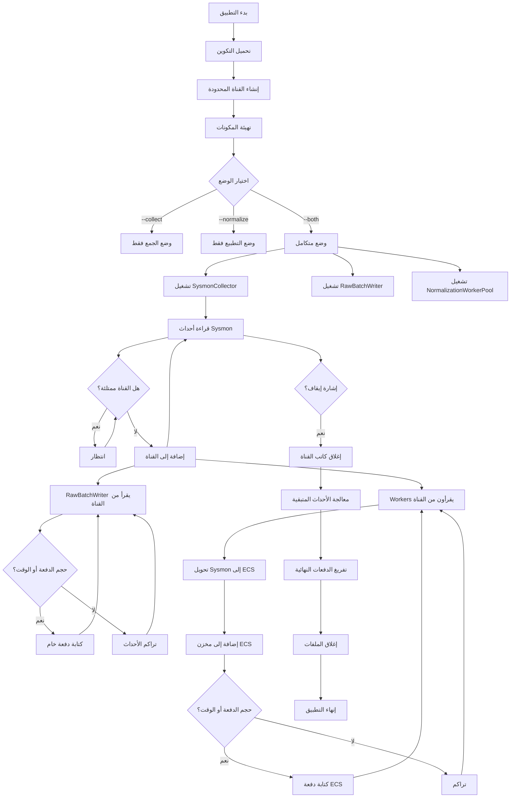
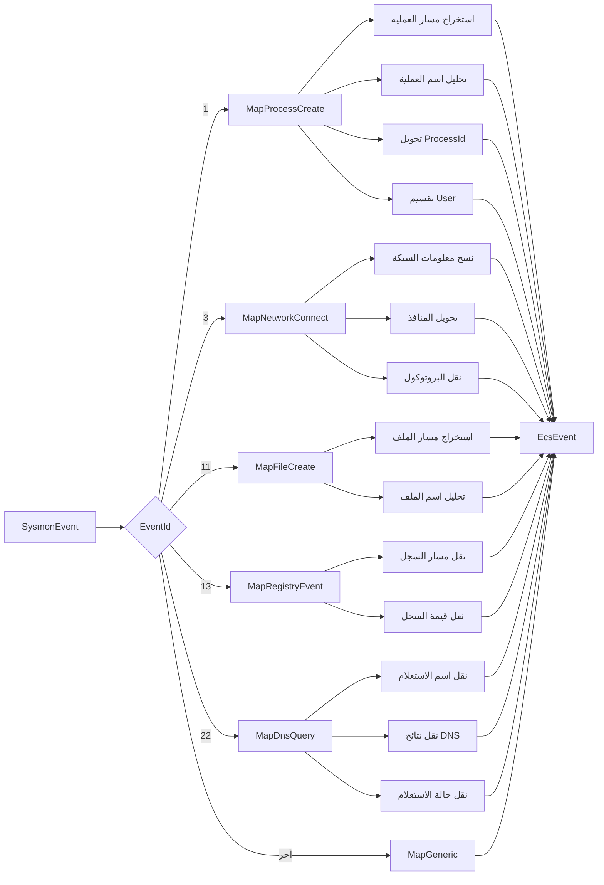
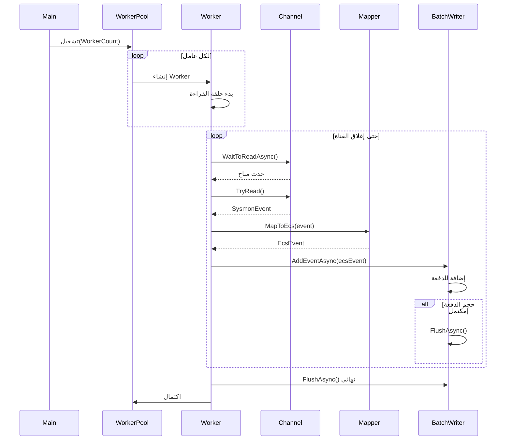
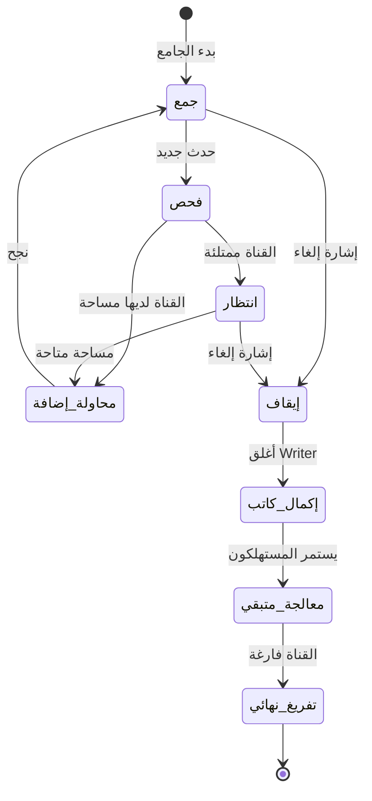

<div dir="rtl">

# وثائق EDR Agent: دليل تقني شامل
## بنية النظام وآليات التنفيذ

---

## الملخص التنفيذي

يقدم هذا المستند نظرة تقنية شاملة حول نظام EDR Agent، وهو تطبيق مراقبة أمنية عالي الأداء مصمم لتحويل بيانات القياس عن بُعد الخام من Sysmon إلى تنسيق Elastic Common Schema الموحد (ECS). يطبق النظام بنية معمارية متطورة قائمة على نمط المنتج والمستهلك (Producer-Consumer) باستخدام قنوات محدودة السعة لمعالجة الأحداث بشكل موثوق وقابل للتوسع مع إدارة الضغط العكسي وقدرات التدهور السلس.

الهدف الأساسي من هذا النظام هو إنشاء خط أنابيب قوي لتوحيد البيانات يحول تنسيقات أحداث Sysmon غير المتجانسة إلى تمثيل ECS موحد، مما يتيح تحليل أمني مبسط واكتشاف التهديدات وإعداد تقارير الامتثال عبر البيئات المؤسسية.

---

## نظرة عامة على البنية المعمارية للنظام

### فلسفة التصميم الأساسية

يستخدم EDR Agent نمط المنتج والمستهلك كأساس لبنيته المعمارية، مستفيداً من إطار عمل System.Threading.Channels لإنشاء مخزن مؤقت محدود بين مراحل جمع البيانات ومعالجتها. يعالج هذا القرار المعماري عدة متطلبات حرجة في معالجة القياس عن بُعد الأمنية عالية الحجم، وهي السلامة من حيث الذاكرة من خلال قيود السعة، والموثوقية التشغيلية من خلال آليات الضغط العكسي، وتحسين الأداء من خلال استراتيجيات المعالجة الدفعية.

تفصل بنية النظام المسؤوليات عبر ثلاثة نطاقات تشغيلية أساسية وهي الجمع والتحويل والاستمرارية. يتيح هذا الفصل توسيع كل مكون بشكل مستقل بناءً على خصائص حمل العمل وتوافر الموارد.

### المكونات المعمارية

تعمل طبقة الجمع كمنتج في خط الأنابيب، حيث تراقب باستمرار مصادر أحداث Sysmon وتضع كائنات الأحداث المنظمة في قناة محدودة. تطبق هذه القناة استراتيجية وضع الامتلاء القائم على الانتظار، مما يضمن عدم إسقاط أي أحداث عندما تتجاوز السعة المعالجة مؤقتاً. بدلاً من ذلك، يتوقف مكون الجمع حتى تصبح السعة متاحة، مما يوفر سلوكاً حتمياً تحت الحمل.

تتكون طبقة التحويل من مجموعة عمال قابلة للتكوين تستهلك الأحداث من القناة، وتطبق منطق تعيين خاص بنوع الحدث لتحويل بنى Sysmon إلى تنسيق ECS، وتجهز النتائج الموحدة للكتابة الدفعية. تمكن بنية مجموعة العمال من التوسع الأفقي من خلال تعديلات التكوين دون تعديلات الكود.

تطبق طبقة الاستمرارية استراتيجيات الكتابة الدفعية لكل من تدفقات الأحداث الخام والموحدة. من خلال تجميع الأحداث في مخازن مؤقتة بالذاكرة والتفريغ على فترات قابلة للتكوين أو عتبات حجم، يقلل النظام من عمليات إدخال وإخراج القرص مع الحفاظ على خصائص زمن الوصول المقبولة. يتعامل الكتاب المنفصلون مع الحفظ الخام لـ Sysmon والمخرجات الموحدة لـ ECS، مما يدعم حالات الاستخدام الأرشيفية والتشغيلية.

### تسلسل تدفق البيانات

يتقدم تدفق البيانات الكامل عبر خمس مراحل متميزة. في البداية، يراقب مكون جامع Sysmon مصادر أحداث النظام ويبني كائنات أحداث مكتوبة تمثل إنشاء العمليات واتصالات الشبكة وعمليات الملفات وتعديلات السجل واستعلامات DNS. ثم توضع هذه الكائنات المنظمة في القناة المحدودة، حيث تنشط آليات الضغط العكسي إذا كانت سعة المعالجة اللاحقة غير كافية.

تسحب خيوط المستهلك العاملة في مجموعة العمال الأحداث من القناة وتوجهها إلى وظائف التعيين المناسبة بناءً على معرفات نوع الحدث. تستخرج طبقة التعيين الحقول ذات الصلة من بنية Sysmon، وتطبق التحويلات مثل تنسيق الطابع الزمني وتحليل المستخدم الرئيسي، وتملأ حقول مخطط ECS المقابلة. تتراكم الأحداث المعينة في مخازن مؤقتة بالذاكرة حتى الوصول إلى عتبات حجم الدفعة أو فترات التفريغ.

عند الوصول إلى العتبات المكونة، يقوم كتاب الدفعات بتسلسل الأحداث المتراكمة إلى تنسيق JSONL ويلحقها بملفات المخرجات المحددة باستخدام عمليات إدخال وإخراج غير متزامنة. يحفظ كاتب الدفعات الخام قياس Sysmon الأصلي لأغراض الأرشفة، بينما يخرج كاتب الدفعات الموحد مستندات ECS الموحدة لمنصات التحليلات الأمنية اللاحقة.

أثناء تسلسلات الإغلاق السلس التي تبدأ بإشارات الإلغاء، يكمل الجامع دورة الجمع الحالية ويستدعي طريقة إكمال كاتب القناة. يشير هذا إلى جميع المستهلكين بأنه لن تصل أحداث إضافية. تستمر خيوط المستهلك في معالجة محتويات القناة المتبقية، وتفرغ أي دفعات جزئية إلى القرص، وتغلق مقابض الملفات بشكل صحيح قبل الإنهاء. يضمن هذا النهج سلامة البيانات ويمنع ملفات المخرجات المبتورة أثناء إيقاف التطبيق.

---

## هيكل المشروع التفصيلي

```
EDR_agent/
│
├── Models/
│   ├── SysmonEvent.cs
│   └── EcsEvent.cs
│
├── Collectors/
│   └── SysmonCollector.cs
│
├── Parsing/
│   └── SysmonParser.cs
│
├── Mapping/
│   └── SysmonToEcsMapper.cs
│
├── Services/
│   ├── NormalizationService.cs
│   ├── RawBatchWriter.cs
│   ├── NormalizationWorkerPool.cs
│   └── NormalizedBatchWriter.cs
│
├── Writing/
│   └── EcsWriter.cs
│
├── Config/
│   └── AgentOptions.cs
│
└── Program.cs
```

يتبع هيكل المشروع تنظيماً هرمياً يعكس فصل المسؤوليات في البنية المعمارية. يحتوي مجلد Models على تعريفات نماذج البيانات لكل من أحداث Sysmon الخام وأحداث ECS الموحدة. يحتوي مجلد Collectors على مكون SysmonCollector المسؤول عن الحصول على الأحداث. يوفر مجلد Parsing أدوات مساعدة لقراءة وتحليل ملفات JSONL. يحتوي مجلد Mapping على منطق التحويل من Sysmon إلى ECS.

يحتوي مجلد Services على المكونات الأساسية للتنسيق والمعالجة، بما في ذلك RawBatchWriter لكتابة الأحداث الخام، وNormalizationWorkerPool لإدارة عمال التحويل، وNormalizedBatchWriter لإخراج ECS. يحتوي مجلد Writing على أدوات مساعدة إضافية للكتابة. يحتوي مجلد Config على تعريف AgentOptions الذي يجمع جميع المعلمات القابلة للتكوين. يعمل ملف Program.cs كنقطة دخول التطبيق ويدير التنسيق الشامل.

---

## مواصفات المكونات التفصيلية

### نماذج البيانات

#### ملف Models/SysmonEvent.cs

يحدد نموذج SysmonEvent بنية القياس عن بُعد الخام الملتقط من مراقبة نظام Windows. يتضمن هذا النموذج بيانات تعريف زمنية من خلال حقل الطابع الزمني، وتصنيف الحدث عبر حقل معرف الحدث الصحيح، وتحديد المضيف من خلال حقل اسم الكمبيوتر، وبنية بيانات متداخلة تحتوي على سمات خاصة بالحدث.

```csharp
using System.Text.Json.Serialization;

public class SysmonEvent 
{
    [JsonPropertyName("Timestamp")]
    public string Timestamp { get; set; }

    [JsonPropertyName("EventId")]
    public int EventId { get; set; }

    [JsonPropertyName("Computer")]
    public string Computer { get; set; }

    [JsonPropertyName("Data")]
    public SysmonData Data { get; set; }
}

public class SysmonData 
{
    [JsonPropertyName("UtcTime")]
    public string UtcTime { get; set; }

    [JsonPropertyName("Image")]
    public string Image { get; set; }

    [JsonPropertyName("ProcessId")]
    public string ProcessId { get; set; }

    [JsonPropertyName("CommandLine")]
    public string CommandLine { get; set; }

    [JsonPropertyName("User")]
    public string User { get; set; }

    // حقول الشبكة (EventId = 3)
    [JsonPropertyName("Protocol")]
    public string Protocol { get; set; }

    [JsonPropertyName("SourceIp")]
    public string SourceIp { get; set; }

    [JsonPropertyName("SourcePort")]
    public string SourcePort { get; set; }

    [JsonPropertyName("DestinationIp")]
    public string DestinationIp { get; set; }

    [JsonPropertyName("DestinationPort")]
    public string DestinationPort { get; set; }

    // حقول الملفات (EventId = 11)
    [JsonPropertyName("TargetFilename")]
    public string TargetFilename { get; set; }

    [JsonPropertyName("FileName")]
    public string FileName { get; set; }

    // حقول السجل (EventId = 13)
    [JsonPropertyName("TargetObject")]
    public string TargetObject { get; set; }

    [JsonPropertyName("Details")]
    public string Details { get; set; }

    // حقول العملية الأب (قد تظهر في بيانات Sysmon)
    [JsonPropertyName("ParentProcessId")]
    public string ParentProcessId { get; set; }

    [JsonPropertyName("ParentImage")]
    public string ParentImage { get; set; }

    [JsonPropertyName("ParentCommandLine")]
    public string ParentCommandLine { get; set; }

    [JsonPropertyName("ParentUser")]
    public string ParentUser { get; set; }

    // حقول DNS (EventId = 22)
    [JsonPropertyName("QueryName")]
    public string QueryName { get; set; }

    [JsonPropertyName("QueryResults")]
    public string QueryResults { get; set; }

    [JsonPropertyName("QueryStatus")]
    public string QueryStatus { get; set; }
}
```

يستوعب كائن البيانات المتداخل مجموعات حقول متفاوتة عبر أنواع الأحداث المختلفة، بما في ذلك:
- **الحقول الأساسية**: الطابع الزمني UTC، مسارات تنفيذ العملية، معرفات العملية، وسائط سطر الأوامر، ومعلومات المستخدم
- **حقول الشبكة**: عناوين IP المصدر والوجهة، المنافذ، والبروتوكول
- **حقول الملفات**: مسارات الملفات المستهدفة وأسماء الملفات
- **حقول السجل**: مسارات الكائنات المستهدفة والتفاصيل
- **حقول العملية الأب**: معلومات العملية الأب بما في ذلك المسار والمعرف وسطر الأوامر
- **حقول DNS**: أسماء الاستعلامات ونتائجها وحالة الاستعلام

#### ملف Models/EcsEvent.cs

يمثل نموذج EcsEvent المخرجات الموحدة المطابقة لمواصفات Elastic Common Schema. تتضمن هذه البنية حقل طابع زمني موحد مع اصطلاح بادئة رمز at، وحقول تصنيف الحدث للكود والفئة والإجراء، وحقول تحديد المضيف، وبيانات تعريف العملية بما في ذلك مسارات قابلة للتنفيذ وأسماء العمليات والمعرفات، وسياق المستخدم مع مكونات النطاق والاسم المفصولة، ومعلومات بروتوكول الشبكة ونقطة النهاية، ومسارات وأسماء نظام الملفات، ومسارات وقيم السجل، وتفاصيل استعلام DNS.

```csharp
using System.Text.Json.Serialization;

public class EcsEvent 
{
    [JsonPropertyName("@timestamp")]
    public string Timestamp { get; set; }

    [JsonPropertyName("event.code")]
    public int EventCode { get; set; }

    [JsonPropertyName("event.category")]
    public string EventCategory { get; set; }

    [JsonPropertyName("event.action")]
    public string EventAction { get; set; }

    [JsonPropertyName("host.name")]
    public string HostName { get; set; }

    [JsonPropertyName("process.executable")]
    public string ProcessExecutable { get; set; }

    [JsonPropertyName("process.name")]
    public string ProcessName { get; set; }

    [JsonPropertyName("process.command_line")]
    public string ProcessCommandLine { get; set; }

    [JsonPropertyName("process.pid")]
    public int? ProcessPid { get; set; }

    [JsonPropertyName("user.domain")]
    public string UserDomain { get; set; }

    [JsonPropertyName("user.name")]
    public string UserName { get; set; }

    // حقول الشبكة
    [JsonPropertyName("source.ip")]
    public string SourceIp { get; set; }

    [JsonPropertyName("source.port")]
    public int? SourcePort { get; set; }

    [JsonPropertyName("destination.ip")]
    public string DestinationIp { get; set; }

    [JsonPropertyName("destination.port")]
    public int? DestinationPort { get; set; }

    [JsonPropertyName("network.protocol")]
    public string NetworkProtocol { get; set; }

    // حقول الملفات
    [JsonPropertyName("file.path")]
    public string FilePath { get; set; }

    [JsonPropertyName("file.name")]
    public string FileName { get; set; }

    // حقول DNS
    [JsonPropertyName("dns.question.name")]
    public string DnsQuestionName { get; set; }

    [JsonPropertyName("dns.answers")]
    public string DnsAnswers { get; set; }

    [JsonPropertyName("url.domain")]
    public string UrlDomain { get; set; }

    [JsonPropertyName("dns.response_code")]
    public string DnsResponseCode { get; set; }

    // حقول السجل
    [JsonPropertyName("registry.path")]
    public string RegistryKey { get; set; }

    [JsonPropertyName("registry.value")]
    public string RegistryValue { get; set; }

    // حقول العملية الأب
    [JsonPropertyName("process.parent.executable")]
    public string ProcessParentExecutable { get; set; }

    [JsonPropertyName("process.parent.name")]
    public string ProcessParentName { get; set; }
}
```

يتيح هذا المخطط الموحد الاستعلام المتسق والتحليل عبر مصادر البيانات الأمنية غير المتجانسة. ملاحظات مهمة:
- استخدام `int?` (نوع nullable) للحقول الرقمية الاختيارية مثل ProcessPid وSourcePort وDestinationPort
- حقل `registry.path` يتم تخزينه في متغير `RegistryKey` (ليس RegistryPath)
- حقل `url.domain` يتم ملؤه من استعلامات DNS لتسهيل البحث والتحليل
- حقول العملية الأب تساعد في تتبع سلسلة العمليات واكتشاف التهديدات

### مكون الجمع

#### ملف Collectors/SysmonCollector.cs

يعمل مكون SysmonCollector كواجهة اكتساب البيانات الأولية، وهو مسؤول عن قراءة أحداث Sysmon مباشرة من Windows Event Log وتوزيعها إلى قنوات المعالجة. على عكس الأنظمة التقليدية التي تقرأ من ملفات، يتصل هذا المكون مباشرة بنظام سجلات أحداث Windows باستخدام `EventLogReader` و `EventLogQuery`.

**الميزات الرئيسية:**
- قراءة مباشرة من سجل أحداث Sysmon (`Microsoft-Windows-Sysmon/Operational`)
- تصفية الأحداث حسب معرفات محددة (1, 3, 11, 13, 22)
- تحليل XML لاستخراج بيانات الحدث
- الكتابة المتزامنة إلى قناتين منفصلتين (raw و normalize)
- معالجة دفعية للأحداث مع تأخير قابل للتكوين
- دعم الإيقاف السلس عبر CancellationToken

```csharp
using System;
using System.Collections.Generic;
using System.Diagnostics.Eventing.Reader;
using System.Threading;
using System.Threading.Tasks;
using System.Xml;
using EDR_agent.Models;

namespace EDR_agent.Collectors
{
    public class SysmonCollector
    {
        private const string SYSMON_LOG_NAME = "Microsoft-Windows-Sysmon/Operational";
        private const string EVENT_QUERY_FILTER = "*[System[(EventID=1 or EventID=3 or EventID=11 or EventID=13 or EventID=22)]]";
        private const int BATCH_SIZE = 50;
        private const int BATCH_DELAY_MS = 2000;

        public async Task RunAsync(
            System.Threading.Channels.ChannelWriter<SysmonEvent> rawWriter, 
            System.Threading.Channels.ChannelWriter<SysmonEvent> normalizeWriter, 
            CancellationToken cancellationToken)
        {
            var query = new EventLogQuery(SYSMON_LOG_NAME, PathType.LogName, EVENT_QUERY_FILTER);

            using (var reader = new EventLogReader(query))
            {
                while (!cancellationToken.IsCancellationRequested)
                {
                    try
                    {
                        var events = ReadEventBatch(reader, BATCH_SIZE);

                        if (events.Count > 0)
                        {
                            foreach (var evt in events)
                            {
                                await rawWriter.WriteAsync(evt, cancellationToken);
                                await normalizeWriter.WriteAsync(evt, cancellationToken);
                            }
                        }

                        await Task.Delay(BATCH_DELAY_MS, cancellationToken);
                    }
                    catch (OperationCanceledException)
                    {
                        break;
                    }
                    catch (Exception ex)
                    {
                        Console.WriteLine("SysmonCollector error: " + ex.Message);
                        await Task.Delay(BATCH_DELAY_MS, cancellationToken);
                    }
                }
            }

            rawWriter.Complete();
            normalizeWriter.Complete();
        }

        private List<SysmonEvent> ReadEventBatch(EventLogReader reader, int maxEvents)
        {
            var events = new List<SysmonEvent>();
            EventRecord record;

            while ((record = reader.ReadEvent()) != null && events.Count < maxEvents)
            {
                using (record)
                {
                    try
                    {
                        var evt = ParseEvent(record);
                        if (evt != null) events.Add(evt);
                    }
                    catch (Exception ex)
                    {
                        Console.WriteLine("Failed to parse event: " + ex.Message);
                    }
                }
            }

            return events;
        }

        private SysmonEvent ParseEvent(EventRecord record)
        {
            var xml = record.ToXml();
            var xmlDoc = new XmlDocument();
            xmlDoc.LoadXml(xml);

            var dataNodes = xmlDoc.GetElementsByTagName("Data");
            var data = new SysmonData();

            foreach (XmlElement node in dataNodes)
            {
                var name = node.GetAttribute("Name");
                var value = node.InnerText;

                switch (name)
                {
                    case "UtcTime": data.UtcTime = value; break;
                    case "Image": data.Image = value; break;
                    case "ProcessId": data.ProcessId = value; break;
                    case "CommandLine": data.CommandLine = value; break;
                    case "User": data.User = value; break;
                    case "Protocol": data.Protocol = value; break;
                    case "SourceIp": data.SourceIp = value; break;
                    case "SourcePort": data.SourcePort = value; break;
                    case "DestinationIp": data.DestinationIp = value; break;
                    case "DestinationPort": data.DestinationPort = value; break;
                    case "TargetFilename": data.TargetFilename = value; break;
                    case "FileName": data.FileName = value; break;
                    case "TargetObject": data.TargetObject = value; break;
                    case "Details": data.Details = value; break;
                    case "ParentProcessId": data.ParentProcessId = value; break;
                    case "ParentImage": data.ParentImage = value; break;
                    case "ParentCommandLine": data.ParentCommandLine = value; break;
                    case "ParentUser": data.ParentUser = value; break;
                    case "QueryName": data.QueryName = value; break;
                    case "QueryResults": data.QueryResults = value; break;
                    case "QueryStatus": data.QueryStatus = value; break;
                }
            }

            return new SysmonEvent
            {
                Timestamp = record.TimeCreated?.ToString("o") ?? DateTime.UtcNow.ToString("o"),
                EventId = (int)record.Id,
                Computer = record.MachineName ?? "UNKNOWN",
                Data = data
            };
        }
    }
}
```

**آلية العمل التفصيلية:**

1. **إنشاء الاستعلام**: يتم إنشاء `EventLogQuery` يستهدف سجل Sysmon مع تصفية XPath للأحداث المطلوبة فقط (EventID: 1, 3, 11, 13, 22).

2. **القراءة الدفعية**: يقرأ الجامع الأحداث على دفعات (50 حدث افتراضياً) لتحسين الأداء وتقليل استهلاك الموارد.

3. **تحليل XML**: كل حدث يتم تحويله إلى XML ثم تحليله لاستخراج جميع حقول البيانات باستخدام `XmlDocument`.

4. **التوزيع المزدوج**: يتم كتابة كل حدث إلى قناتين منفصلتين للحفظ الأرشيفي والمعالجة.

5. **الضغط العكسي التلقائي**: عند امتلاء القنوات، تحظر `WriteAsync` تلقائياً حتى تصبح السعة متاحة.

6. **الإغلاق السلس**: عند الإلغاء، يكمل الجامع دورة الجمع ثم يستدعي `Complete()` على القناتين.

### أدوات التحليل

#### ملف Parsing/SysmonParser.cs

يوفر مكون SysmonParser وظائف مساعدة لقراءة ملفات الأحداث بتنسيق JSONL وإلغاء تسلسلها. يدعم هذا المكون السيناريوهات حيث يحدث تناول الأحداث من مصادر الملفات بدلاً من مراقبة النظام في الوقت الفعلي.

```csharp
using System.Text.Json;

public static class SysmonParser 
{
    public static IEnumerable<SysmonEvent> ReadEvents(string inputFilePath) 
    {
        if (!File.Exists(inputFilePath)) 
        {
            Console.WriteLine($"ملف الإدخال غير موجود: {inputFilePath}");
            yield break;
        }

        var options = new JsonSerializerOptions 
        {
            PropertyNameCaseInsensitive = true
        };

        foreach (var line in File.ReadLines(inputFilePath)) 
        {
            if (string.IsNullOrWhiteSpace(line)) 
                continue;

            SysmonEvent evt = null;
            try 
            {
                evt = JsonSerializer.Deserialize<SysmonEvent>(line, options);
            } 
            catch (JsonException ex) 
            {
                Console.WriteLine($"خطأ في تحليل السطر: {ex.Message}");
                continue;
            }

            if (evt != null) 
                yield return evt;
        }
    }
}
```

يقرأ المحلل ملف الإدخال سطراً بسطر، ويلغي تسلسل كل كائن JSON إلى مثيل SysmonEvent باستخدام مسلسل System.Text.Json، ويعطي تسلسلاً قابلاً للعد مناسباً للمعالجة الدفعية أو سيناريوهات البث. يعتمد التعامل مع الأخطاء داخل المحلل استراتيجية المتابعة عند الخطأ، مما يسجل إخفاقات إلغاء التسلسل دون إنهاء عملية التحليل الشاملة.

### منطق التعيين

#### ملف Mapping/SysmonToEcsMapper.cs

يطبق مكون SysmonToEcsMapper منطق التحويل الأساسي الذي يحول بنى Sysmon الخاصة بالحدث إلى تمثيلات ECS موحدة. يستخدم هذا المكون آلية توجيه بناءً على قيم معرف الحدث، ويرسل كل حدث إلى وظيفة تعيين متخصصة تتوافق مع نوعه.

```csharp
public static class SysmonToEcsMapper 
{
    public static EcsEvent MapToEcs(SysmonEvent sysmonEvent) 
    {
        if (sysmonEvent == null) 
            return null;

        return sysmonEvent.EventId switch 
        {
            1 => MapProcessCreate(sysmonEvent),
            3 => MapNetworkConnect(sysmonEvent),
            11 => MapFileCreate(sysmonEvent),
            13 => MapRegistryEvent(sysmonEvent),
            22 => MapDnsQuery(sysmonEvent),
            _ => MapGeneric(sysmonEvent)
        };
    }

    private static EcsEvent MapProcessCreate(SysmonEvent evt) 
    {
        var ecs = new EcsEvent 
        {
            Timestamp = FormatTimestamp(evt.Timestamp),
            EventCode = evt.EventId,
            EventCategory = "process",
            EventAction = "start",
            HostName = evt.Computer,
            ProcessExecutable = evt.Data.Image,
            ProcessCommandLine = evt.Data.CommandLine
        };

        if (!string.IsNullOrEmpty(evt.Data.Image)) 
        {
            var parts = evt.Data.Image.Split('\\');
            ecs.ProcessName = parts[parts.Length - 1];
        }

        if (int.TryParse(evt.Data.ProcessId, out int pid)) 
        {
            ecs.ProcessPid = pid;
        }

        if (!string.IsNullOrEmpty(evt.Data.User)) 
        {
            var userParts = evt.Data.User.Split('\\');
            if (userParts.Length == 2) 
            {
                ecs.UserDomain = userParts[0];
                ecs.UserName = userParts[1];
            } 
            else 
            {
                ecs.UserName = evt.Data.User;
            }
        }

        return ecs;
    }

    private static EcsEvent MapNetworkConnect(SysmonEvent evt) 
    {
        var ecs = new EcsEvent 
        {
            Timestamp = FormatTimestamp(evt.Timestamp),
            EventCode = evt.EventId,
            EventCategory = "network",
            EventAction = "connection_established",
            HostName = evt.Computer,
            ProcessExecutable = evt.Data.Image,
            NetworkProtocol = evt.Data.Protocol,
            SourceIp = evt.Data.SourceIp,
            DestinationIp = evt.Data.DestinationIp
        };

        if (int.TryParse(evt.Data.ProcessId, out int pid)) 
        {
            ecs.ProcessPid = pid;
        }

        if (int.TryParse(evt.Data.SourcePort, out int srcPort)) 
        {
            ecs.SourcePort = srcPort;
        }

        if (int.TryParse(evt.Data.DestinationPort, out int dstPort)) 
        {
            ecs.DestinationPort = dstPort;
        }

        if (!string.IsNullOrEmpty(evt.Data.User)) 
        {
            var userParts = evt.Data.User.Split('\\');
            if (userParts.Length == 2) 
            {
                ecs.UserDomain = userParts[0];
                ecs.UserName = userParts[1];
            }
        }

        return ecs;
    }

    private static EcsEvent MapFileCreate(SysmonEvent evt) 
    {
        var ecs = new EcsEvent 
        {
            Timestamp = FormatTimestamp(evt.Timestamp),
            EventCode = evt.EventId,
            EventCategory = "file",
            EventAction = "create",
            HostName = evt.Computer,
            ProcessExecutable = evt.Data.Image,
            FilePath = evt.Data.TargetFilename
        };

        if (!string.IsNullOrEmpty(evt.Data.TargetFilename)) 
        {
            var parts = evt.Data.TargetFilename.Split('\\');
            ecs.FileName = parts[parts.Length - 1];
        }

        if (int.TryParse(evt.Data.ProcessId, out int pid)) 
        {
            ecs.ProcessPid = pid;
        }

        if (!string.IsNullOrEmpty(evt.Data.User)) 
        {
            var userParts = evt.Data.User.Split('\\');
            if (userParts.Length == 2) 
            {
                ecs.UserDomain = userParts[0];
                ecs.UserName = userParts[1];
            }
        }

        return ecs;
    }

    private static EcsEvent MapRegistryEvent(SysmonEvent evt) 
    {
        var ecs = new EcsEvent 
        {
            Timestamp = FormatTimestamp(evt.Timestamp),
            EventCode = evt.EventId,
            EventCategory = "registry",
            EventAction = "modification",
            HostName = evt.Computer,
            ProcessExecutable = evt.Data.Image,
            RegistryPath = evt.Data.TargetObject,
            RegistryValue = evt.Data.Details
        };

        if (int.TryParse(evt.Data.ProcessId, out int pid)) 
        {
            ecs.ProcessPid = pid;
        }

        if (!string.IsNullOrEmpty(evt.Data.User)) 
        {
            var userParts = evt.Data.User.Split('\\');
            if (userParts.Length == 2) 
            {
                ecs.UserDomain = userParts[0];
                ecs.UserName = userParts[1];
            }
        }

        return ecs;
    }

    private static EcsEvent MapDnsQuery(SysmonEvent evt) 
    {
        var ecs = new EcsEvent 
        {
            Timestamp = FormatTimestamp(evt.Timestamp),
            EventCode = evt.EventId,
            EventCategory = "network",
            EventAction = "dns_query",
            HostName = evt.Computer,
            ProcessExecutable = evt.Data.Image,
            DnsQuestionName = evt.Data.QueryName,
            DnsAnswers = evt.Data.QueryResults,
            DnsResponseCode = evt.Data.QueryStatus
        };

        if (int.TryParse(evt.Data.ProcessId, out int pid)) 
        {
            ecs.ProcessPid = pid;
        }

        if (!string.IsNullOrEmpty(evt.Data.User)) 
        {
            var userParts = evt.Data.User.Split('\\');
            if (userParts.Length == 2) 
            {
                ecs.UserDomain = userParts[0];
                ecs.UserName = userParts[1];
            }
        }

        return ecs;
    }

    private static EcsEvent MapGeneric(SysmonEvent evt) 
    {
        return new EcsEvent 
        {
            Timestamp = FormatTimestamp(evt.Timestamp),
            EventCode = evt.EventId,
            HostName = evt.Computer
        };
    }

    private static string FormatTimestamp(string timestamp) 
    {
        if (DateTime.TryParse(timestamp, out DateTime dt)) 
        {
            return dt.ToString("yyyy-MM-ddTHH:mm:ss.fffZ");
        }
        return timestamp;
    }
}
```

تتضمن جميع وظائف التعيين تطبيع الطابع الزمني لضمان التمثيل الزمني المتسق عبر أنواع الأحداث. يقسم تحليل سياق المستخدم سلاسل النطاق واسم المستخدم المركبة على محدد الشرطة المائلة العكسية، ويتعامل مع كل من التنسيقات المؤهلة بالكامل والحساب المحلي.

### خدمات الكتابة الدفعية

#### ملف Services/RawBatchWriter.cs

يطبق مكون RawBatchWriter التخزين المستمر لقياس Sysmon غير المعدل. تعمل هذه الخدمة كمستهلك خلفية، وتقرأ باستمرار من القناة المحدودة وتراكم الأحداث في مخزن مؤقت داخل الذاكرة.

```csharp
using System.Text.Json;
using System.Threading.Channels;

public class RawBatchWriter 
{
    private readonly ChannelReader<SysmonEvent> _reader;
    private readonly string _outputPath;
    private readonly int _batchSize;
    private readonly int _flushIntervalMs;
    private readonly JsonSerializerOptions _jsonOptions;

    public RawBatchWriter(
        ChannelReader<SysmonEvent> reader, 
        string outputPath, 
        int batchSize, 
        int flushIntervalMs)
    {
        _reader = reader;
        _outputPath = outputPath;
        _batchSize = batchSize;
        _flushIntervalMs = flushIntervalMs;
        _jsonOptions = new JsonSerializerOptions 
        { 
            WriteIndented = false 
        };
    }

    public async Task RunAsync(CancellationToken cancellationToken) 
    {
        var batch = new List<SysmonEvent>();
        var lastFlush = DateTime.UtcNow;

        using var fileStream = new FileStream(
            _outputPath, 
            FileMode.Append, 
            FileAccess.Write, 
            FileShare.Read);
        using var writer = new StreamWriter(fileStream);

        while (await _reader.WaitToReadAsync(cancellationToken)) 
        {
            while (_reader.TryRead(out var evt)) 
            {
                batch.Add(evt);

                var shouldFlush = batch.Count >= _batchSize ||
                    (DateTime.UtcNow - lastFlush).TotalMilliseconds >= _flushIntervalMs;

                if (shouldFlush) 
                {
                    await FlushBatchAsync(batch, writer);
                    batch.Clear();
                    lastFlush = DateTime.UtcNow;
                }
            }
        }

        if (batch.Count > 0) 
        {
            await FlushBatchAsync(batch, writer);
        }
    }

    private async Task FlushBatchAsync(
        List<SysmonEvent> batch, 
        StreamWriter writer) 
    {
        foreach (var evt in batch) 
        {
            var json = JsonSerializer.Serialize(evt, _jsonOptions);
            await writer.WriteLineAsync(json);
        }
        await writer.FlushAsync();
        Console.WriteLine($"RawBatchWriter: تم تفريغ {batch.Count} حدث");
    }
}
```

عندما يصل المخزن المؤقت إلى عتبة حجم الدفعة المكونة أو عندما ينقضي فاصل التفريغ المكون، يتم تسلسل الأحداث المتراكمة إلى تنسيق JSONL وإلحاقها بملف الأحداث الخام المحدد.

#### ملف Services/NormalizationWorkerPool.cs

يدير مكون NormalizationWorkerPool مجموعة قابلة للتكوين من مهام العامل التي تستهلك الأحداث من القناة، وتطبق تحويلات تعيين ECS، وتجهز النتائج للكتابة الدفعية.

```csharp
using System.Threading.Channels;

public class NormalizationWorkerPool 
{
    private readonly ChannelReader<SysmonEvent> _reader;
    private readonly NormalizedBatchWriter _batchWriter;
    private readonly int _workerCount;

    public NormalizationWorkerPool(
        ChannelReader<SysmonEvent> reader,
        NormalizedBatchWriter batchWriter,
        int workerCount)
    {
        _reader = reader;
        _batchWriter = batchWriter;
        _workerCount = workerCount;
    }

    public async Task RunAsync(CancellationToken cancellationToken) 
    {
        var tasks = new List<Task>();

        for (int i = 0; i < _workerCount; i++) 
        {
            var workerId = i;
            tasks.Add(Task.Run(async () => 
            {
                await WorkerAsync(workerId, cancellationToken);
            }));
        }

        await Task.WhenAll(tasks);
    }

    private async Task WorkerAsync(int workerId, CancellationToken cancellationToken) 
    {
        while (await _reader.WaitToReadAsync(cancellationToken)) 
        {
            while (_reader.TryRead(out var sysmonEvent)) 
            {
                try 
                {
                    var ecsEvent = SysmonToEcsMapper.MapToEcs(sysmonEvent);
                    if (ecsEvent != null) 
                    {
                        await _batchWriter.AddEventAsync(ecsEvent);
                    }
                } 
                catch (Exception ex) 
                {
                    Console.WriteLine($"عامل {workerId}: خطأ في التحويل - {ex.Message}");
                }
            }
        }
    }
}
```

يحدد حجم المجموعة بواسطة معلمة تكوين WorkerCount، مما يتيح مستويات التزامن المناسبة لحمل العمل. يعمل كل عامل بشكل مستقل، مما يمنع إخفاقات في عامل واحد من التأثير على الآخرين في المجموعة.

#### ملف Services/NormalizedBatchWriter.cs

```csharp
using System.Text.Json;

public class NormalizedBatchWriter 
{
    private readonly string _outputPath;
    private readonly int _batchSize;
    private readonly int _flushIntervalMs;
    private readonly List<EcsEvent> _batch;
    private readonly SemaphoreSlim _semaphore;
    private readonly JsonSerializerOptions _jsonOptions;
    private DateTime _lastFlush;

    public NormalizedBatchWriter(
        string outputPath, 
        int batchSize, 
        int flushIntervalMs)
    {
        _outputPath = outputPath;
        _batchSize = batchSize;
        _flushIntervalMs = flushIntervalMs;
        _batch = new List<EcsEvent>();
        _semaphore = new SemaphoreSlim(1, 1);
        _jsonOptions = new JsonSerializerOptions 
        { 
            WriteIndented = false 
        };
        _lastFlush = DateTime.UtcNow;
    }

    public async Task AddEventAsync(EcsEvent ecsEvent) 
    {
        await _semaphore.WaitAsync();
        try 
        {
            _batch.Add(ecsEvent);

            var shouldFlush = _batch.Count >= _batchSize ||
                (DateTime.UtcNow - _lastFlush).TotalMilliseconds >= _flushIntervalMs;

            if (shouldFlush) 
            {
                await FlushAsync();
            }
        } 
        finally 
        {
            _semaphore.Release();
        }
    }

    public async Task FlushAsync() 
    {
        if (_batch.Count == 0) 
            return;

        using var fileStream = new FileStream(
            _outputPath, 
            FileMode.Append, 
            FileAccess.Write, 
            FileShare.Read);
        using var writer = new StreamWriter(fileStream);

        foreach (var evt in _batch) 
        {
            var json = JsonSerializer.Serialize(evt, _jsonOptions);
            await writer.WriteLineAsync(json);
        }

        await writer.FlushAsync();
        Console.WriteLine($"NormalizedBatchWriter: تم تفريغ {_batch.Count} حدث");

        _batch.Clear();
        _lastFlush = DateTime.UtcNow;
    }
}
```

يستخدم الكاتب عمليات إدخال وإخراج غير متزامنة من خلال واجهات FileStream وStreamWriter، مما يقلل من حجب الخيط أثناء عمليات القرص.

### إدارة التكوين

#### ملف Config/AgentOptions.cs

يحدد مكون AgentOptions جميع المعلمات القابلة للتكوين من قبل المستخدم التي تحكم سلوك النظام.

```csharp
using System.Text.Json.Serialization;

public class AgentOptions 
{
    [JsonPropertyName("BatchSize")]
    public int BatchSize { get; set; } = 50;

    [JsonPropertyName("FlushIntervalMs")]
    public int FlushIntervalMs { get; set; } = 1000;

    [JsonPropertyName("ChannelCapacity")]
    public int ChannelCapacity { get; set; } = 1000;

    [JsonPropertyName("WorkerCount")]
    public int WorkerCount { get; set; } = 4;

    [JsonPropertyName("RawFilePath")]
    public string RawFilePath { get; set; } = 
        "events.jsonl";

    [JsonPropertyName("NormalizedFilePath")]
    public string NormalizedFilePath { get; set; } = 
        "events_normalized_ecs.jsonl";
}
```

تتضمن حقول التكوين الحرجة BatchSize الذي يحدد عدد الأحداث قبل تشغيل عملية الكتابة، وFlushIntervalMs الذي يحدد المدة القصوى بالمللي ثانية بين عمليات الكتابة بغض النظر عن حجم الدفعة، وChannelCapacity الذي يحدد الحد الأقصى لعدد الأحداث التي يمكن إدراجها في القائمة في القناة المحدودة، وWorkerCount الذي يحدد عدد عمال التطبيع المتزامنين في المجموعة.

### تنسيق التطبيق

#### ملف Program.cs

يعمل مكون Program كنقطة دخول التطبيق، وهو مسؤول عن التهيئة والتنسيق وتنسيق الإغلاق.

```csharp
using System.Text.Json;
using System.Threading.Channels;

public class Program 
{
    private static AgentOptions _options;
    private static Channel<SysmonEvent> _channel;

    public static async Task Main(string[] args) 
    {
        Console.WriteLine("---------- EDR Agent (Sysmon → ECS) ----------");

        LoadConfiguration();
        PrintConfiguration();

        var mode = ParseArguments(args);
        var cts = new CancellationTokenSource();

        Console.CancelKeyPress += (sender, e) => 
        {
            e.Cancel = true;
            Console.WriteLine("\nجاري الإيقاف...");
            cts.Cancel();
        };

        try 
        {
            switch (mode) 
            {
                case "collect":
                    await RunCollectOnlyAsync(cts.Token);
                    break;
                case "normalize":
                    await RunNormalizeOnlyAsync(cts.Token);
                    break;
                case "both":
                default:
                    await RunBothAsync(cts.Token);
                    break;
            }
        } 
        catch (Exception ex) 
        {
            Console.WriteLine($"خطأ: {ex.Message}");
        }

        Console.WriteLine("انتهى البرنامج.");
    }

    private static void LoadConfiguration() 
    {
        var configPath = Path.Combine(
            Environment.GetFolderPath(Environment.SpecialFolder.ApplicationData),
            "EDRAgent",
            "agent_config.json");

        if (File.Exists(configPath)) 
        {
            var json = File.ReadAllText(configPath);
            _options = JsonSerializer.Deserialize<AgentOptions>(json);
            Console.WriteLine($"تم تحميل التكوين من: {configPath}");
        } 
        else 
        {
            _options = new AgentOptions();
            Console.WriteLine($"ملف التكوين غير موجود في: {configPath}. استخدام الافتراضيات.");
        }
    }

    private static void PrintConfiguration() 
    {
        Console.WriteLine($"مسار ملف Sysmon المدخل: {_options.RawFilePath}");
        Console.WriteLine($"مسار ملف ECS المخرج: {_options.NormalizedFilePath}");
        Console.WriteLine($"حجم الدفعة: {_options.BatchSize}");
        Console.WriteLine($"فاصل التفريغ: {_options.FlushIntervalMs} مللي ثانية");
        Console.WriteLine($"سعة القناة: {_options.ChannelCapacity}");
        Console.WriteLine($"عدد العمال: {_options.WorkerCount}");
    }

    private static string ParseArguments(string[] args) 
    {
        if (args.Length > 0) 
        {
            if (args[0] == "--collect") return "collect";
            if (args[0] == "--normalize") return "normalize";
            if (args[0] == "--both") return "both";
        }
        return "both";
    }

    private static async Task RunBothAsync(CancellationToken cancellationToken) 
    {
        Console.WriteLine("بدء وضع الجمع+التطبيع (اضغط Ctrl+C للإيقاف)...\n");

        _channel = Channel.CreateBounded<SysmonEvent>(
            new BoundedChannelOptions(_options.ChannelCapacity) 
            {
                FullMode = BoundedChannelFullMode.Wait
            });

        var collector = new SysmonCollector(_channel.Writer, _options.RawFilePath);
        var rawWriter = new RawBatchWriter(
            _channel.Reader, 
            _options.RawFilePath, 
            _options.BatchSize, 
            _options.FlushIntervalMs);

        var normalizedWriter = new NormalizedBatchWriter(
            _options.NormalizedFilePath, 
            _options.BatchSize, 
            _options.FlushIntervalMs);

        var workerPool = new NormalizationWorkerPool(
            _channel.Reader, 
            normalizedWriter, 
            _options.WorkerCount);

        var collectorTask = Task.Run(async () => 
        {
            await collector.RunAsync(cancellationToken);
            _channel.Writer.Complete();
        });

        var rawWriterTask = rawWriter.RunAsync(cancellationToken);
        var normalizationTask = workerPool.RunAsync(cancellationToken);

        await Task.WhenAll(collectorTask, rawWriterTask, normalizationTask);
        await normalizedWriter.FlushAsync();
    }

    private static async Task RunCollectOnlyAsync(CancellationToken cancellationToken) 
    {
        Console.WriteLine("بدء وضع الجمع فقط...\n");
        // تنفيذ مشابه لـ RunBothAsync لكن بدون التطبيع
    }

    private static async Task RunNormalizeOnlyAsync(CancellationToken cancellationToken) 
    {
        Console.WriteLine("بدء وضع التطبيع فقط...\n");
        // قراءة من الملف وتطبيع
    }
}
```

---

## مخططات التدفق والمنطق

### تدفق البيانات الرئيسي



### منطق تعيين الأحداث



### دورة حياة العامل



### آلية الضغط العكسي



---

## أمثلة تحويل الأحداث

### مثال 1: حدث إنشاء عملية (EventId = 1)

#### Sysmon (مدخل):

```json
{
  "Timestamp": "2025-01-15T10:30:45",
  "EventId": 1,
  "Computer": "DESKTOP-USER",
  "Data": {
    "Image": "C:\\Windows\\System32\\notepad.exe",
    "ProcessId": "1234",
    "CommandLine": "notepad.exe C:\\test.txt",
    "User": "DOMAIN\\Admin"
  }
}
```

#### ECS (مخرج):

```json
{
  "@timestamp": "2025-01-15T10:30:45.000Z",
  "event.code": 1,
  "event.category": "process",
  "event.action": "start",
  "host.name": "DESKTOP-USER",
  "process.executable": "C:\\Windows\\System32\\notepad.exe",
  "process.name": "notepad.exe",
  "process.pid": 1234,
  "process.command_line": "notepad.exe C:\\test.txt",
  "user.domain": "DOMAIN",
  "user.name": "Admin"
}
```

**شرح التحويل:**
- استخراج اسم العملية من المسار الكامل
- تحويل ProcessId من نص إلى رقم صحيح
- تقسيم User إلى domain و name
- تنسيق الطابع الزمني حسب معيار ECS

### مثال 2: حدث اتصال شبكي (EventId = 3)

#### Sysmon (مدخل):

```json
{
  "Timestamp": "2025-01-15T11:05:20",
  "EventId": 3,
  "Computer": "DESKTOP-USER",
  "Data": {
    "Image": "C:\\Windows\\System32\\chrome.exe",
    "ProcessId": "4321",
    "SourceIp": "192.168.1.15",
    "SourcePort": "52144",
    "DestinationIp": "142.250.185.36",
    "DestinationPort": "443",
    "Protocol": "TCP",
    "User": "DOMAIN\\User01"
  }
}
```

#### ECS (مخرج):

```json
{
  "@timestamp": "2025-01-15T11:05:20.000Z",
  "event.code": 3,
  "event.category": "network",
  "event.action": "connection_established",
  "host.name": "DESKTOP-USER",
  "process.executable": "C:\\Windows\\System32\\chrome.exe",
  "process.pid": 4321,
  "user.domain": "DOMAIN",
  "user.name": "User01",
  "network.protocol": "TCP",
  "source.ip": "192.168.1.15",
  "source.port": 52144,
  "destination.ip": "142.250.185.36",
  "destination.port": 443
}
```

**شرح التحويل:**
- تعيين الفئة إلى "network"
- تعيين الإجراء إلى "connection_established"
- نقل معلومات البروتوكول والعناوين
- تحويل المنافذ من نص إلى أرقام

### مثال 3: حدث إنشاء ملف (EventId = 11)

#### Sysmon (مدخل):

```json
{
  "Timestamp": "2025-01-15T12:10:03",
  "EventId": 11,
  "Computer": "DESKTOP-USER",
  "Data": {
    "Image": "C:\\Windows\\System32\\powershell.exe",
    "ProcessId": "777",
    "TargetFilename": "C:\\Users\\User01\\Documents\\report.txt",
    "User": "DOMAIN\\User01"
  }
}
```

#### ECS (مخرج):

```json
{
  "@timestamp": "2025-01-15T12:10:03.000Z",
  "event.code": 11,
  "event.category": "file",
  "event.action": "create",
  "host.name": "DESKTOP-USER",
  "process.executable": "C:\\Windows\\System32\\powershell.exe",
  "process.pid": 777,
  "user.domain": "DOMAIN",
  "user.name": "User01",
  "file.path": "C:\\Users\\User01\\Documents\\report.txt",
  "file.name": "report.txt"
}
```

**شرح التحويل:**
- تعيين الفئة إلى "file"
- استخراج اسم الملف من المسار الكامل
- الاحتفاظ بالمسار الكامل في file.path

### مثال 4: حدث تعديل السجل (EventId = 13)

#### Sysmon (مدخل):

```json
{
  "Timestamp": "2025-01-15T13:22:41",
  "EventId": 13,
  "Computer": "DESKTOP-USER",
  "Data": {
    "Image": "C:\\Windows\\System32\\reg.exe",
    "ProcessId": "1599",
    "TargetObject": "HKCU\\Software\\MyApp\\Settings\\Theme",
    "Details": "REG_SZ: Dark",
    "User": "DOMAIN\\Admin"
  }
}
```

#### ECS (مخرج):

```json
{
  "@timestamp": "2025-01-15T13:22:41.000Z",
  "event.code": 13,
  "event.category": "registry",
  "event.action": "modification",
  "host.name": "DESKTOP-USER",
  "process.executable": "C:\\Windows\\System32\\reg.exe",
  "process.pid": 1599,
  "user.domain": "DOMAIN",
  "user.name": "Admin",
  "registry.path": "HKCU\\Software\\MyApp\\Settings\\Theme",
  "registry.value": "REG_SZ: Dark"
}
```

**شرح التحويل:**
- تعيين الفئة إلى "registry"
- نقل مسار الكائن المستهدف
- نقل تفاصيل التعديل

### مثال 5: حدث استعلام DNS (EventId = 22)

#### Sysmon (مدخل):

```json
{
  "Timestamp": "2025-01-15T14:07:55",
  "EventId": 22,
  "Computer": "DESKTOP-USER",
  "Data": {
    "Image": "C:\\Windows\\System32\\svchost.exe",
    "ProcessId": "8888",
    "QueryName": "example.com",
    "QueryResults": "93.184.216.34",
    "QueryStatus": "SUCCESS",
    "User": "DOMAIN\\SYSTEM"
  }
}
```

#### ECS (مخرج):

```json
{
  "@timestamp": "2025-01-15T14:07:55.000Z",
  "event# استكمال وثائق EDR Agent

## المحتوى المفقود الذي يجب إضافته

### 1. استكمال مثال DNS (EventId = 22)

```json
{
  "@timestamp": "2025-01-15T14:07:55.000Z",
  "event.code": 22,
  "event.category": "network",
  "event.action": "dns_query",
  "host.name": "DESKTOP-USER",
  "process.executable": "C:\\Windows\\System32\\svchost.exe",
  "process.pid": 8888,
  "user.domain": "DOMAIN",
  "user.name": "SYSTEM",
  "dns.question.name": "example.com",
  "dns.answers": "93.184.216.34",
  "url.domain": "example.com",
  "dns.response_code": "SUCCESS"
}
```

**شرح التحويل:**
- تعيين الفئة إلى "network" والإجراء إلى "dns_query"
- نقل اسم الاستعلام إلى dns.question.name
- نقل نتائج الاستعلام إلى dns.answers
- نسخ اسم النطاق إلى url.domain لتسهيل البحث
- نقل حالة الاستعلام إلى dns.response_code

---

## الأقسام الإضافية المطلوبة

### كيفية التشغيل والاستخدام

#### متطلبات النظام

- **نظام التشغيل**: Windows 10/11 أو Windows Server 2016+
- **.NET Runtime**: .NET 8.0 أو أحدث
- **Sysmon**: يجب تثبيت وتكوين Sysmon على النظام
- **الصلاحيات**: صلاحيات المسؤول لقراءة سجلات الأحداث

#### أوضاع التشغيل

يدعم EDR Agent ثلاثة أوضاع تشغيل:

**1. وضع التطبيع فقط (normalize) - الوضع الافتراضي**
```bash
EDR_agent.exe
# أو
EDR_agent.exe --normalize
```
يقرأ من ملف `events.jsonl` ويحوله إلى تنسيق ECS.

**2. وضع الجمع فقط (collect)**
```bash
EDR_agent.exe --collect
```
يجمع الأحداث من Windows Event Log ويحفظها في ملف خام.

**3. وضع متكامل (both)**
```bash
EDR_agent.exe --both
```
يجمع الأحداث ويطبعها ويحولها في نفس الوقت.

#### ملف التكوين

يمكن تخصيص سلوك النظام عبر ملف `agent_config.json` في المسار:
```
%APPDATA%\EDRAgent\agent_config.json
```

مثال على ملف التكوين:
```json
{
  "BatchSize": 50,
  "FlushIntervalMs": 2000,
  "ChannelCapacity": 1000,
  "WorkerCount": 2,
  "RawFilePath": "",
  "NormalizedFilePath": ""
}
```

**معاملات التكوين:**
- `BatchSize`: عدد الأحداث قبل الكتابة (افتراضي: 50)
- `FlushIntervalMs`: الفاصل الزمني بالمللي ثانية للكتابة (افتراضي: 2000)
- `ChannelCapacity`: سعة القنوات المحدودة (افتراضي: 1000)
- `WorkerCount`: عدد عمال التطبيع المتزامنين (افتراضي: 2)

---

### استكشاف الأخطاء والحلول

#### المشكلة: "Access Denied" عند قراءة سجلات الأحداث

**الحل**: تشغيل التطبيق بصلاحيات المسؤول:
```bash
Run as Administrator
```

#### المشكلة: لا توجد أحداث يتم جمعها

**الأسباب المحتملة:**
1. Sysmon غير مثبت أو غير قيد التشغيل
2. تصفية الأحداث لا تطابق أي أحداث موجودة
3. سجل Sysmon فارغ

**الحل**:
- تحقق من تثبيت Sysmon: `Get-Service Sysmon64`
- تحقق من وجود أحداث: `Get-WinEvent -LogName "Microsoft-Windows-Sysmon/Operational" -MaxEvents 10`

#### المشكلة: استهلاك عالي للذاكرة

**الحل**: تقليل `ChannelCapacity` و `BatchSize` في ملف التكوين.

#### المشكلة: أخطاء في تحليل XML

**السبب**: أحداث Sysmon بتنسيق غير متوقع

**الحل**: التحقق من إصدار Sysmon وتحديثه إذا لزم الأمر.

---

### الأسئلة الشائعة

**س: هل يمكن تشغيل EDR Agent على Linux؟**
ج: لا، النظام مصمم خصيصاً لـ Windows حيث يعتمد على Windows Event Log و Sysmon.

**س: كيف يمكنني إيقاف التطبيق بشكل آمن؟**
ج: اضغط `Ctrl+C` في وحدة التحكم. سيكمل النظام معالجة الأحداث المعلقة ويغلق بشكل سلس.

**س: هل يمكن تغيير معرفات الأحداث المراقبة؟**
ج: نعم، يمكن تعديل `EVENT_QUERY_FILTER` في `SysmonCollector.cs` وإعادة بناء المشروع.

**س: ما هو الفرق بين الملف الخام والملف الموحد؟**
ج: الملف الخام يحتوي على أحداث Sysmon الأصلية، بينما الملف الموحد يحتوي على الأحداث المحولة إلى تنسيق ECS.

**س: كيف يمكنني زيادة الأداء؟**
ج: زيادة `WorkerCount` و `BatchSize` في ملف التكوين، مع مراقبة استهلاك الموارد.

---

### ملاحظات ختامية

تم إعداد هذه الوثيقة لتوفير فهم شامل لنظام EDR Agent، بما في ذلك بنيته المعمارية، ومكوناته التفصيلية، وآليات عمله، وأمثلة عملية. النظام مصمم ليكون قابلاً للتوسع والتكوين، مما يتيح التكيف مع متطلبات البيئات المؤسسية المختلفة.

للحصول على أحدث التحديثات والمساهمة في المشروع، يرجى الرجوع إلى مستودع الكود المصدري.

</div>

